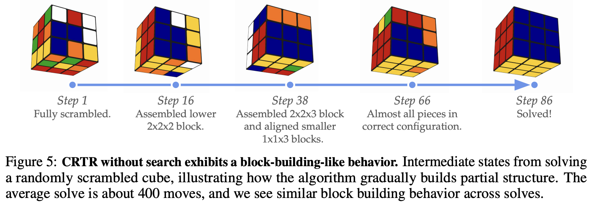

</img>

## contrastive-rl

For following a [new line of research](https://arxiv.org/abs/2206.07568) that started in 2022 from [Eysenbach](https://ben-eysenbach.github.io/) et al.

This is important not because of contrastive learning, but because it happens to be a special case where the RL and SSL algorithm is one. It reveals how "traditional" RL is unable to build up representations alone.

*Update: Finally seeing it, at about 3-5k steps*

## install

```shell
$ pip install contrastive-rl-pytorch
```

## usage

```python
import torch
from contrastive_rl_pytorch import ContrastiveRLTrainer

from x_mlps_pytorch import AttnResidualNormedMLP

encoder = AttnResidualNormedMLP(dim = 256, dim_in = 16, dim_out = 128, depth = 4, use_rmsnorm = True)

trainer = ContrastiveRLTrainer(encoder)

trajectories = torch.randn(256, 512, 16)

trainer(trajectories, 100)

# train for 100 steps and save

torch.save(encoder.state_dict(), './trained.pt')
```

## discount conditioning (multi-horizon)

You can condition both the critic and actor on discount factor $\gamma$ to learn across multiple timescales simultaneously (multi-horizon conditioning / Geometric Horizon Models).

Following [Farebrother et al.](https://arxiv.org/abs/2602.19634), the discount is transformed into a 3-feature embedding $(\gamma, 1 - \gamma, -\log(1 - \gamma))$, where $-\log(1 - \gamma) = \log(H)$ provides linear sensitivity to the effective timescale $H = \frac{1}{1 - \gamma}$:

```python
import torch
from contrastive_rl_pytorch import (
    ContrastiveRLTrainer,
    ActorTrainer,
    default_discount_transform
)
from x_mlps_pytorch import MLP

# critic and actor accept discount embedding (dim = 3)

critic = MLP(16 + 4 + 3, 256, 128)
goal_encoder = MLP(16, 256, 128)
actor = MLP(16 + 16 + 3, 256, 4)

# train across a continuum of horizons via uniform discount sampling

critic_trainer = ContrastiveRLTrainer(
    critic,
    goal_encoder,
    discount = (0.85, 0.999),
    discount_condition = True,
    discount_transform = default_discount_transform
)

actor_trainer = ActorTrainer(
    actor,
    critic,
    goal_encoder,
    discount = (0.85, 0.999),
    discount_condition = True,
    discount_transform = default_discount_transform,
    num_discrete_actions = 4
)

trajectories = torch.randn(32, 100, 16)
actions = torch.randn(32, 100, 4)

critic_trainer(trajectories, 100, actions = actions)
actor_trainer(trajectories, 100)

# at inference, dynamically steer the policy with any desired horizon:

state = torch.randn(1, 16)
goal = torch.randn(1, 16)

# far horizon (H ~ 1000): aggressive transit towards distant goals
action_far = actor(torch.cat((state, goal, default_discount_transform(0.999)), dim = -1)).argmax(dim = -1)

# short horizon (H ~ 7): gentle terminal settling and obstacle avoidance
action_near = actor(torch.cat((state, goal, default_discount_transform(0.85)), dim = -1)).argmax(dim = -1)
```

## quick test

make sure `uv` is installed `pip install uv`

then

```shell
$ uv run train_cartpole.py --critic_action_repr softmax_probs
```

categorical actions, with the critic conditioned on the softmax probabilities, solve cartpole within a few dozen episodes

for a harder continuous control example

```shell
$ uv run train_lunar.py --cpu
```

wait until 3-5k steps at least

## citations

```bibtex
@misc{eysenbach2023contrastivelearninggoalconditionedreinforcement,
    title   = {Contrastive Learning as Goal-Conditioned Reinforcement Learning},
    author  = {Benjamin Eysenbach and Tianjun Zhang and Ruslan Salakhutdinov and Sergey Levine},
    year    = {2023},
    eprint  = {2206.07568},
    archivePrefix = {arXiv},
    primaryClass = {cs.LG},
    url     = {https://arxiv.org/abs/2206.07568},
}
```

```bibtex
@misc{ziarko2025contrastiverepresentationstemporalreasoning,
    title   = {Contrastive Representations for Temporal Reasoning},
    author  = {Alicja Ziarko and Michal Bortkiewicz and Michal Zawalski and Benjamin Eysenbach and Piotr Milos},
    year    = {2025},
    eprint  = {2508.13113},
    archivePrefix = {arXiv},
    primaryClass = {cs.LG},
    url     = {https://arxiv.org/abs/2508.13113},
}
```

```bibtex
@inproceedings{anonymous2025hierarchical,
    title   = {Hierarchical Contrastive Reinforcement Learning: learn representation more suitable for {RL} environments},
    author  = {Anonymous},
    booktitle = {Submitted to The Fourteenth International Conference on Learning Representations},
    year    = {2025},
    url     = {https://openreview.net/forum?id=rTCSFOzVcK},
    note    = {under review}
}
```

```bibtex
@misc{liu2024singlegoalneedskills,
    title   = {A Single Goal is All You Need: Skills and Exploration Emerge from Contrastive RL without Rewards, Demonstrations, or Subgoals},
    author  = {Grace Liu and Michael Tang and Benjamin Eysenbach},
    year    = {2024},
    eprint  = {2408.05804},
    archivePrefix = {arXiv},
    primaryClass = {cs.LG},
    url     = {https://arxiv.org/abs/2408.05804},
}
```

```bibtex
@inproceedings{anonymous2025demystifying,
    title   = {Demystifying Emergent Exploration in Goal-Conditioned {RL}},
    author  = {Anonymous},
    booktitle = {Submitted to The Fourteenth International Conference on Learning Representations},
    year    = {2025},
    url     = {https://openreview.net/forum?id=mwgYORsqtv},
    note    = {under review}
}
```

```bibtex
@inproceedings{wang2025,
    title   = {1000 Layer Networks for Self-Supervised {RL}: Scaling Depth Can Enable New Goal-Reaching Capabilities},
    author  = {Kevin Wang and Ishaan Javali and Micha{\l} Bortkiewicz and Tomasz Trzcinski and Benjamin Eysenbach},
    booktitle = {The Thirty-ninth Annual Conference on Neural Information Processing Systems},
    year    = {2025},
    url     = {https://openreview.net/forum?id=s0JVsx3bx1}
}
```

```bibtex
@misc{nimonkar2025selfsupervisedgoalreachingresultsmultiagent,
    title   = {Self-Supervised Goal-Reaching Results in Multi-Agent Cooperation and Exploration},
    author  = {Chirayu Nimonkar and Shlok Shah and Catherine Ji and Benjamin Eysenbach},
    year    = {2025},
    eprint  = {2509.10656},
    archivePrefix = {arXiv},
    primaryClass = {cs.LG},
    url     = {https://arxiv.org/abs/2509.10656},
}
```

```bibtex
@misc{yin2026emergentdexteritydiverseresets,
    title   = {Emergent Dexterity via Diverse Resets and Large-Scale Reinforcement Learning},
    author  = {Patrick Yin and Tyler Westenbroek and Zhengyu Zhang and Joshua Tran and Ignacio Dagnino and Eeshani Shilamkar and Numfor Mbiziwo-Tiapo and Simran Bagaria and Xinlei Liu and Galen Mullins and Andrey Kolobov and Abhishek Gupta},
    year    = {2026},
    eprint  = {2603.15789},
    archivePrefix = {arXiv},
    primaryClass = {cs.RO},
    url     = {https://arxiv.org/abs/2603.15789},
}
```

```bibtex
@inproceedings{wang2023optimal,
    title   = {Optimal Goal-Reaching Reinforcement Learning via Quasimetric Learning},
    author  = {Tongzhou Wang and Antonio Torralba and Phillip Isola and Amy Zhang},
    booktitle = {International Conference on Machine Learning (ICML)},
    year    = {2023},
    url     = {https://arxiv.org/abs/2304.01203}
}
```

```bibtex
@misc{korniak2026stepstimelearningrepresentations,
    title   = {Three Steps at a Time: Learning Representations from Action Sequences in Contrastive RL},
    author  = {Michal Korniak and Kamil Dybek and Benjamin Eysenbach and Marco Bagatella and Micha{\l} Bortkiewicz},
    year    = {2026},
    eprint  = {2608.30640},
    archivePrefix = {arXiv},
    primaryClass = {cs.LG},
    url     = {https://arxiv.org/abs/2608.30640}
}
```

```bibtex
@article{farebrother2026compositional,
    title   = {Compositional Planning with Jumpy World Models},
    author  = {Jesse Farebrother and Matteo Pirotta and Andrea Tirinzoni and Marc G. Bellemare and Alessandro Lazaric and Ahmed Touati},
    journal = {arXiv preprint arXiv:2602.19634},
    year    = {2026}
}
```

```bibtex
@inproceedings{he2026distributions,
    title   = {Distributions as Actions: A Unified Framework for Diverse Action Spaces},
    author  = {Jiamin He and A. Rupam Mahmood and Martha White},
    booktitle = {International Conference on Learning Representations (ICLR)},
    year    = {2026},
    eprint  = {2506.16608},
    archivePrefix = {arXiv},
    primaryClass = {cs.LG}
}
```
